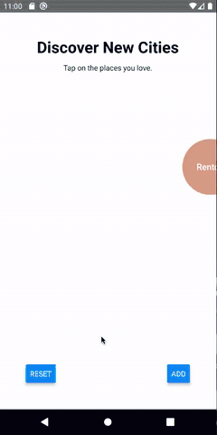

# React Native Bubble Select

> This project is mostly `stale` at the moment. I haven't had time to maintain it, so the code is outdated. Feel free to open a pull request though and I will try review it once I get the chance to

An easy-to-use customizable bubble animation picker, similar to the Apple Music genre selection


## Features

- iOS & Android Support (In beta)
- Typescript Support
- Customizable

## iOS Example


Advanced Example


## Android Example



## Installation

Install the library using either yarn or npm like so:

```sh
yarn add react-native-bubble-select
```

```sh
npm install --save react-native-bubble-select
```

### iOS Installation

If you're using React Native versions > 60.0, it's relatively straightforward.

```sh
cd ios && pod install
```

For versions below 0.60.0, use rnpm links

- Run `react-native link react-native-bubble-select`
- If linking fails, follow the
  [manual linking steps](https://facebook.github.io/react-native/docs/linking-libraries-ios.html#manual-linking)

#### Additional Steps

This library was written in Swift, so in-order for you app to compile, you need to have at least on .swift file in your source code a bridging header to avoid a runtime error like so:


All you have to do is:

- File > New > File
- Swift File
- Name the file whatever you wish
- When prompted to create a bridging header, do so

You must also include `use_frameworks!` at the top of your `Podfile`

### Android Installation

> **Note** as of version 0.5.0, android support is experimental.

For versions below 0.60.0, follow the linking instructions above.

## Usage

You can view the [example project](./example/src/App.tsx) for more usage.

### Simple Usage

```js
import React from 'react';
import BubbleSelect, { Bubble } from 'react-native-bubble-select';
import { Dimensions } from 'react-native';

const { width, height } = Dimensions.get('window');

const App = () => {
  return (
    <BubbleSelect
      onSelect={bubble => console.log('Selected: ', bubble.id)}
      onDeselect={bubble => console.log('Deselected: ', bubble.id)}
      width={width}
      height={height}
    >
      <Bubble id="bubble-1" text="Bubble One" />
      <Bubble id="bubble-2" text="Bubble Two" />
      <Bubble id="bubble-3" text="Bubble Three" />
      <Bubble id="bubble-4" text="Bubble Four" />
    </BubbleSelect>
  );
};
```

### Advanced Usage

```tsx
import React from 'react';
import { Platform, Dimensions } from 'react-native';
import BubbleSelect, { Bubble, BubbleNode } from 'react-native-bubble-select';
import randomCities from './randomCities';

const { width, height } = Dimensions.get('window');

const App = () => {
  const [cities, setCities] = React.useState(randomCities());
  const [selectedCites, setSelectedCities] = React.useState<BubbleNode[]>([]);
  const [removedCities, setRemovedCities] = React.useState<BubbleNode[]>([]);

  const addCity = () => {
    setCities([...cities, randomCity()]);
  };

  const handleSelect = (bubble: BubbleNode) => {
    setSelectedCities([...selectedCites, bubble]);
  };

  const handleDeselect = (bubble: BubbleNode) => {
    setSelectedCities(selectedCites.filter(({ id }) => id !== bubble.id));
  };

  const handleRemove = (bubble: BubbleNode) => {
    setRemovedCities([...removedCities, bubble]);
  };

  return (
    <BubbleSelect
      onSelect={handleSelect}
      onDeselect={handleDeselect}
      onRemove={handleRemove}
      width={width}
      height={height}
      fontName={Platform.select({
        ios: 'SinhalaSangamMN-Bold',
      })}
      fontSize={16}
    >
      {cities.map(city => (
        <Bubble
          key={city.id}
          id={city.id}
          text={city.text}
          color={city.color}
          selectedColor={city.selectedColor}
          selectedScale={city.selectedScale}
        />
      ))}
    </BubbleSelect>
  );
};
```

## Props

### Common Props

| property        | type   | required | description                                                            | default      |
| --------------- | ------ | -------- | ---------------------------------------------------------------------- | ------------ |
| id              | string | TRUE     | A custom identifier used for identifying the node                      | -            |
| text            | string | TRUE     | The text of the bubble. **Note: on android the text must be unique**   | -            |
| color           | string | FALSE    | The background color of the bubble                                     | black        |
| radius          | number | FALSE    | The radius of the bubble. This value is ignored if autoSize is enabled | 30           |
| fontName        | string | FALSE    | The name of the custom font applied to the bubble                      | Avenir-Black |
| fontSize        | number | FALSE    | The size of the custom font applied to the bubble                      | 13           |
| fontColor       | string | FALSE    | The color of the bubble text                                           | white        |
| backgroundColor | string | FALSE    | The background color of the picker                                     | white        |

### iOS Only Props

| property          | type     | required | description                                                                                                                                    | default      |
| ----------------- | -------- | -------- | ---------------------------------------------------------------------------------------------------------------------------------------------- | ------------ |
| id                | string   | TRUE     | A custom identifier used for identifying the node                                                                                              | -            |
| text              | string   | TRUE     | The text of the bubble. **Note: on android the text must be unique**                                                                           | -            |
| color             | string   | FALSE    | The background color of the bubble                                                                                                             | black        |
| radius            | number   | FALSE    | The radius of the bubble. This value is ignored if autoSize is enabled                                                                         | 30           |
| marginScale       | number   | FALSE    | The margin scale applied to the physics body of the bubble. **recommend that you do not change this value unless you know what you are doing** | 1.01         |
| fontName          | string   | FALSE    | The name of the custom font applied to the bubble                                                                                              | Avenir-Black |
| fontSize          | number   | FALSE    | The size of the custom font applied to the bubble                                                                                              | 13           |
| fontColor         | string   | FALSE    | The color of the bubble text                                                                                                                   | white        |
| lineHeight        | number   | FALSE    | The line height of the bubble. This value is ignored if autoSize is enabled                                                                    | 1.5          |
| borderColor       | string   | FALSE    | The border color of the buble                                                                                                                  | -            |
| borderWidth       | number   | FALSE    | The border width of the bubble                                                                                                                 | -            |
| padding           | number   | FALSE    | Extra padding applied to the bubble contents, if autoSize is enabled                                                                           | 20           |
| selectedScale     | number   | FALSE    | The scale of the selected bubble                                                                                                               | 1.33         |
| deselectedScale   | number   | FALSE    | The scale of the deselected bubble                                                                                                             | 1            |
| animationDuration | number   | FALSE    | The duration of the scale animation                                                                                                            | 0.2          |
| selectedColor     | string   | FALSE    | The background color of the selected bubble                                                                                                    | -            |
| selectedFontColor | string   | FALSE    | The color of the selected bubble text                                                                                                          | -            |
| autoSize          | boolean  | FALSE    | Whether or not the bubble should resize to fit its content                                                                                     | TRUE         |
| initialSelection  | string[] | FALSE    | An id array of the initially selected nodes                                                                                                    | -            |

### Android Only Props

| property          | type     | required | description                                    | default |
| ----------------- | -------- | -------- | ---------------------------------------------- | ------- |
| bubbleSize        | number   | FALSE    | The size of all the bubbles                    | -       |
| gradient          | Gradient | FALSE    | A custom gradient to be applied to the bubbles | -       |
| maxSelectionCount | number   | FALSE    | The max number of selected bubbles             | -       |

#### Gradient

| property   | type                           | required | description                                    | default |
| ---------- | ------------------------------ | -------- | ---------------------------------------------- | ------- |
| startColor | string                         | TRUE     | The size of all the bubbles                    | -       |
| endColor   | string                         | TRUE     | A custom gradient to be applied to the bubbles | -       |
| direction  | enum('vertical', 'horizontal') | TRUE     | The direction of the gradient                  | -       |

> **Note** all required fields must be provided else the application will crash.

## Acknowledgments

- The iOS version is based off of [Magnetic](https://github.com/efremidze/Magnetic)
- The Android version is based off of [Bubble-Picker](https://github.com/igalata/Bubble-Picker)

## Known Issues

### iOS

- on certain occasions only half of the bubbles are shown on the screen #2

### Android

- the title of each bubble must be unique else the wrong element may be returned
- hot reloading does not work #3
- selection handlers are not triggered
- after 5 items are selected, the picker rests, likewise with removed.

## Roadmap

### iOS

- [ ] enable support for images

### Android

- [ ] enable long press to remove
- [ ] auto size bubble based on content
- [ ] enable support for images

### General

- [ ] Improve documentation
- [ ] Unit tests
- [ ] Flow support

## License

MIT
