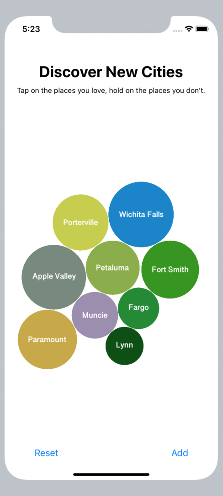

# React Native Bubble Select

An easy-to-use customizable bubble animation picker, similar to the Apple Music genre selection



## Features

- iOS & Android Support (In beta)
- Typescript Support
- Customizable

## iOS Example


## Installation

Install the library using either yarn or npm like so:

```sh
yarn add react-native-bubble-select
```

```sh
npm install --save react-native-bubble-select
```

### iOS Installation

If you're using React Native versions > 60.0, it's relatively straightforward.

```sh
cd ios && pod install
```

For versions below 0.60.0, use rnpm links

- Run `react-native link react-native-bubble-select`
- If linking fails, follow the
  [manual linking steps](https://facebook.github.io/react-native/docs/linking-libraries-ios.html#manual-linking)

#### Additional Steps

This library was written in Swift, so in-order for you app to compile, you need to have at least on .swift file in your source code a bridging header to avoid a runtime error like so:


All you have to do is:

- File > New > File
- Swift File
- Name the file whatever you wish
- When prompted to create a bridging header, do so

You must also include `use_frameworks!` at the top of your `Podfile`

### Android Installation

For versions below 0.60.0, follow the linking instructions above.

## Usage

You can view the [example project](./example/src/App.tsx) for more usage.

```js
import React from 'react';
import BubbleSelect, { Bubble } from 'react-native-bubble-select';
import { Dimensions } from 'react-native';

const { width, height } = Dimensions.get('window');

const App = () => {
  return (
    <BubbleSelect
      onSelect={bubble => console.log('Selected: ', bubble.id)}
      onDeselect={bubble => console.log('Deselected: ', bubble.id)}
      width={width}
      height={height}
    >
      <Bubble id="bubble-1" text="Bubble One" />
      <Bubble id="bubble-2" text="Bubble Two" />
      <Bubble id="bubble-3" text="Bubble Three" />
      <Bubble id="bubble-4" text="Bubble Four" />
    </BubbleSelectonSelect>
  );
};
```

## Props

### Common Props

### iOS Only Props

### Android Only Props

## Acknowledgments

- The iOS version is based off of [Magnetic](https://github.com/efremidze/Magnetic)
- The Android version is based off of [Bubble-Picker](https://github.com/igalata/Bubble-Picker)

### Roadmap

- [ ] Improve documentation
- [ ] Unit tests
- [ ] Flow support

## License

MIT
